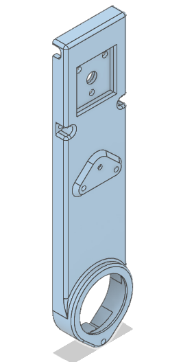
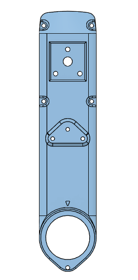

## Encoder Adaptation

The Optical encoder, enocder wheel and mount were replaces woth a magentic encoder.
For this, the AS5047 is mounted facing the end of the of shaft, to which a magnet is attached.
The Covers were modified to accept the footprint of the PCB.
  

## Mechanical Changes

All the covers of the leg modules were equipped with a recess of 3mm debth to hold the encoder board. The Motor-shaft was shortened by 3mm aswell. At the end of the shaft now sits a magnet that gives the rotational inofrmation to the AS5074.
Three holes for mounting as well as spacers are also given.

---
### Magnet for the Encoder
 
* [Magnets Retailer](https://www.magnetkontor.de/products/de/Neodym-Magnete-Rohmagnete/Auswahl-besond-Eigenschaft/diametral-magnetisiert/NdFeB-N52-Scheibenmagnet-4-x-1-mm-vernick-diametr.html?XTCsid=9idd6dnqinqcekutr29q8m7kk4) 

---
### New Shell Covers

* The list of STL files for 3d printing the new shells can be found here: [STL files 3dof leg](stl_files). TODO: Link to new .stl Files

|Hip AA| Hip FE| Upper Leg|
|-------------|-------------|-------------|
|||
|[Hip AA Module New Shell Cover - STL file](../Parts_for_3D_printing/New-Shell-Covers/cover_hip_aa.STL)|[Hip FE Module New Shell Cover - STL file](../Parts_for_3D_printing/New-Shell-Covers/cover_hip_fe.STL)|[Upper Leg Module New Shell Cover - STL file](../Parts_for_3D_printing/New-Shell-Covers/cover_upper_leg.STL)

---
## Electrical changes

As the micro Drivers Require ABI input for the tourque control, the encoders can output ABI, as well as SPI in order tp have the position input ready for the [Master-Board](https://github.com/open-dynamic-robot-initiative/master-board#master-board).

---
### Gerber Files

|PCB Schematic|Photograph|
|-------------|-------------|
|  | |

* The gerber files for the encoder Bord can be found [Here](/Electrical-Changes)

---
### Wires

* The magnetic encoders are wired with as two flatband cables. The colors are the same on all encoders.

|Flatband Cables|Description
|-------------|------|
|  |<table><thead><tr><th>Color</th><th>Pin</th> <th>Description</th></tr></thead><tbody><tr><td>Green</td><td>MOSI</td><td>Master Out Slave In (SPI)</td></tr><tr><td>Yellow</td><td>CS</td><td>chip Select (SPI)</td></tr><tr><td>Orange</td><td>CLK</td><td>clock (SPI)</td></tr><tr><td>Red</td><td>MISO</td><td>Master in Slave Out (SPI)</td></tr>
<tr><td>Marine Blue</td><td>B</td><td>for ABI</td></tr><tr><td>Purple</td><td>A</td><td>"</td></tr><tr><td>Grey</td><td>I</td><td>"</td></tr><tr><td>White</td><td>5V</td><td>Power supply</td></tr><tr><td>Black</td><td>GND</td><td>Ground for SPI and ABI</td></tr></tbody></table>|

  
* The Foot-contact switch wires are glued to the bottom of the "Upper Leg Base":

|Image|Description|
|-------------|------|
| |The three phase foot-contact wire is glued to the side of the enclosure using superglue. Towards theou outbut side is is kept close to the bottom and clears the center Pulley.|
| |On the Output side a small hole was provided to feed through the wire|

* The wired do NOT share all the same clour. The colours are TODO:

|Colors|Pin|Description|
|---|---|
|||

---
### Bill of Material

| Part        | Description | Suppliers   |
|-------------|-------------|------------|
| AS5047 | main IC | [Mouser](mouser.com)|
| C1 | Cap. 0402 100 nf  | " |
| C2 | Cap. 0402 1 uf  | " |
| R1 | optional. 100R for LED_1  | " |
| LED_1 | 0402 LED  | " |

---
## Communication Via Arduino

I used the following [repository](https://github.com/adrien-legrand/AS5X47) by Adrien Legrand to communicate with the AS5047 chip via SPI through an Arduino. The solder bridge labelled "Test" has to be closed for this.

